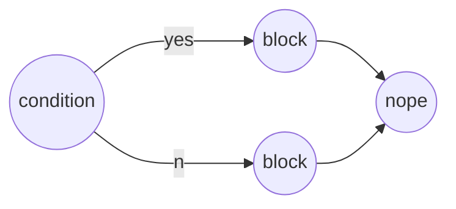
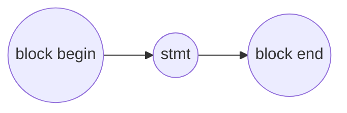
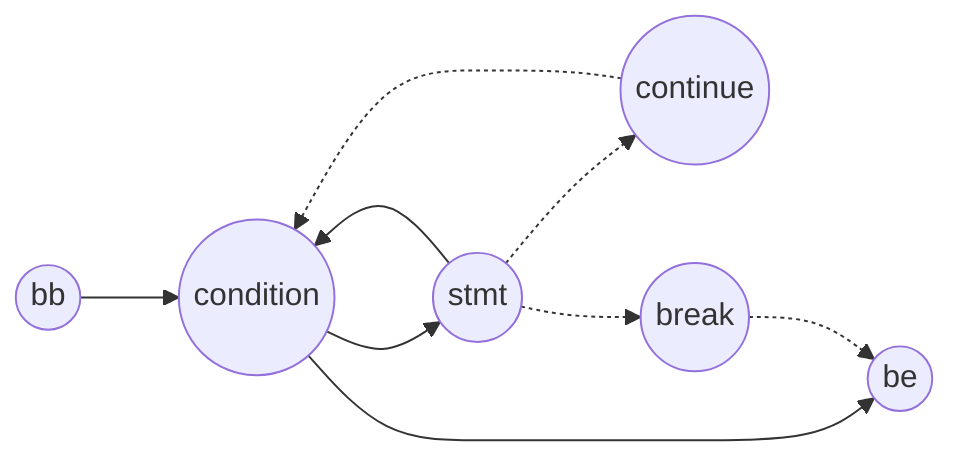
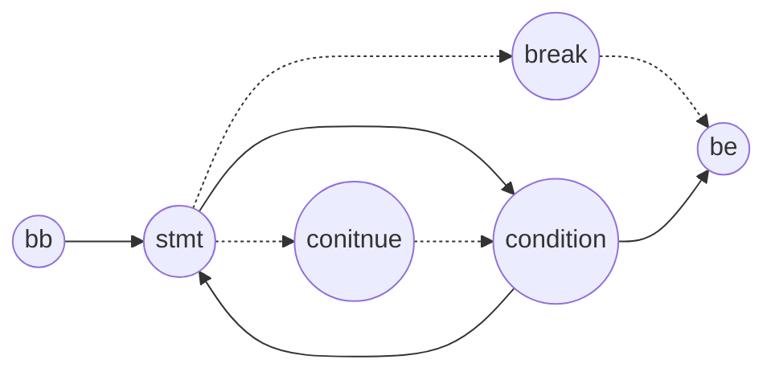
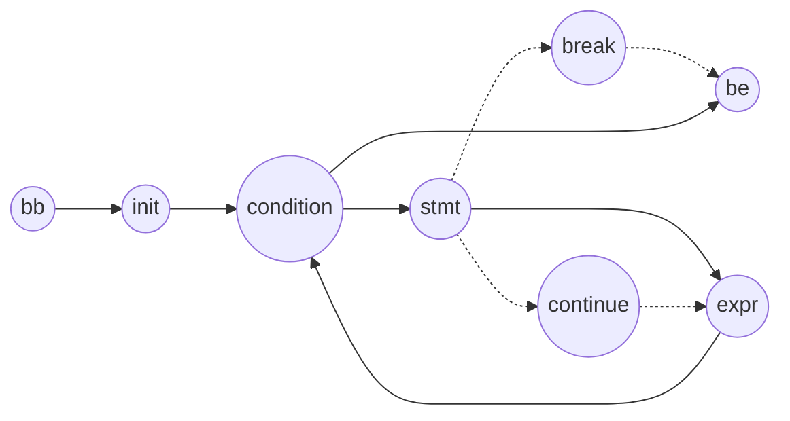

## hython解释器工程结构：

FactoryHandler判断节点由哪个工厂处理->挂Factory到节点中->创建Master用于执行

- RunTimeEnv：程序运行环境，传入抽象语法树即可

- FactoryHandler：（基类）责任链模式，用于给每个节点挂相应的工厂

- IMaster：责任链执行者（具体运行抽象语法树的基类）

- IFactory：（基类）在每个节点中挂一个工厂用于创建处理该节点的IMaster子类对象

- IValue：父类指针

  子类：

  - int
  - double
  - string
  - function
  - list

- Parameter：作用域类

  成员函数：

  ​    Parameter(SParameter next, int = -1);
  ​    void define_param(std::string);作用域内参数定义
  ​    SIValue get(std::string) const;获取作用域内参数的值
  ​    void set(std::string, SIValue);设置作用域内参数的值
  ​    SParameter next() const;下一个作用域
  ​    int pos();

  成员属性：

  - map<string, SIValue> memory存作用域内的参数
  - _next：父作用域
  - _pos：作用域位置（第一个作用域-1）

- visitor：访问者，根据不同类型实现不同操作

  - ValueOperator：
  
    ​            存左值（lvalue），成员函数指针指向IValue的报错函数，结果
  
    ​			其中的visit()用于报错，当子类没有对应传入类型的visit方法时，调用基类的visit()函数并报错(具体实现是调用lvalue中的报错函数)
  
    - IntValueOperator存储左值（left == lvalue  ）:
      - IntValuePlusOpVisitor：具体操作
        - visit()实现操作并存到result属性中
  
  - convertstringvisitor：将每个IValue子类的值（字符串，每个IValue有个val()函数用于返回对象的字符串信息）存到访问者中
  
- DFA：条件状态自动机

  头尾各加一个dfa节点，头节点表示添加一层作用域，尾部表示减少一层作用域

  表达式(expr)，block，条件语句(condition)，函数调用均是状态机的状态（即节点）

  真值以及break、continue的条件是状态机状态转移条件（即边）

  - 在RunTimeEnv::run()中根据抽象语法树创建dfa状态机
  - 调用dfa中的run(p)方法运行状态机
  - jump

  if-else：(else if无分支的最简版本)

​					block:

​					while：

​					do-while：

​					for：

